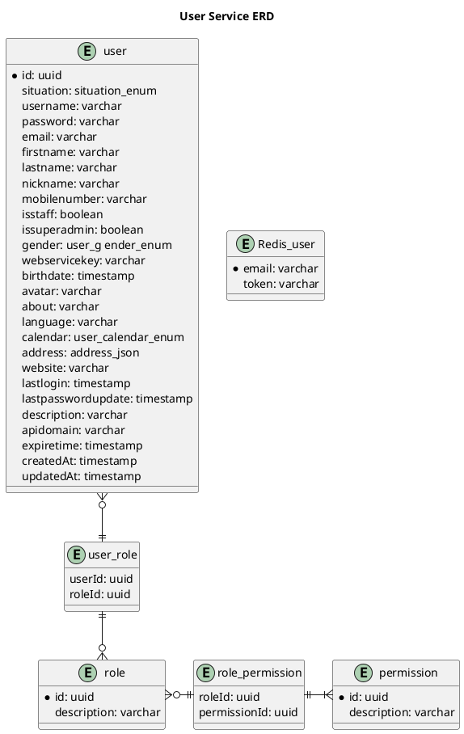

# User service database

## ERD Diagram of the user service

```plantuml
@startuml
title User Service ERD

entity user {
    * id: uuid
    situation: situation_enum
    username: varchar
    password: varchar
    email: varchar
    firstname: varchar
    lastname: varchar
    nickname: varchar
    mobilenumber: varchar
    isstaff: boolean
    issuperadmin: boolean
    gender: user_g ender_enum
    webservicekey: varchar
    birthdate: timestamp
    avatar: varchar
    about: varchar
    language: varchar
    calendar: user_calendar_enum
    address: address_json
    website: varchar
    lastlogin: timestamp
    lastpasswordupdate: timestamp
    description: varchar
    apidomain: varchar
    expiretime: timestamp
    createdAt: timestamp
    updatedAt: timestamp
}

entity user_role {
    userId: uuid
    roleId: uuid
}

entity role {
    * id: uuid
    description: varchar
}

entity role_permission {
    roleId: uuid
    permissionId: uuid
}

entity permission {
    * id: uuid
    description: varchar
}

entity Redis_user {
    * email: varchar
    token: varchar
}

user }o--|| user_role
user_role ||--o{ role


role }o-|| role_permission
role_permission ||-|{ permission

@enduml
```
